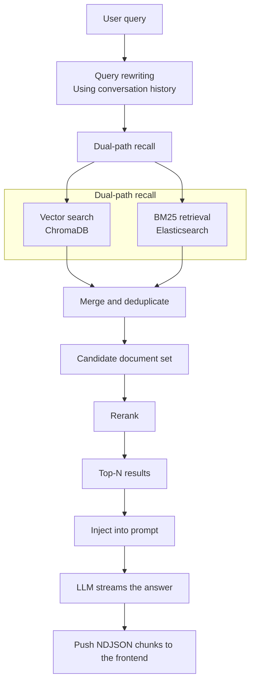

# Xiaolingtong (XLT)

[简体中文](README.md) | [English](README-en.md)

> A RAG-based intelligent campus Q&A system with hybrid retrieval, role-based access control, and knowledge base isolation.

> [!WARNING]
> This README was generated by AI and has not yet been manually reviewed. It is provided for reference only; the source code is the authoritative description of the project's actual behavior.

## Table of Contents

- [Xiaolingtong (XLT)](#xiaolingtong-xlt)
  - [Overview](#overview)
  - [Tech Stack](#tech-stack)
    - [Backend](#backend)
    - [Frontend](#frontend)
  - [Project Structure](#project-structure)
  - [Core Features](#core-features)
    - [1. Intelligent Q&A (RAG)](#1-intelligent-qa-rag)
    - [2. Knowledge Base Management](#2-knowledge-base-management)
    - [3. Roles and Permissions](#3-roles-and-permissions)
    - [4. Session Management](#4-session-management)
    - [5. Announcement System](#5-announcement-system)
  - [Database Design](#database-design)
  - [Quick Start](#quick-start)
    - [Prerequisites](#prerequisites)
    - [1. Install Backend Dependencies](#1-install-backend-dependencies)
    - [2. Configure Environment Variables](#2-configure-environment-variables)
    - [3. Initialize the Database](#3-initialize-the-database)
    - [4. Start the Backend](#4-start-the-backend)
    - [5. Start the Frontend](#5-start-the-frontend)
    - [Default Accounts](#default-accounts)
  - [File and Model Constraints](#file-and-model-constraints)
  - [API Modules](#api-modules)
    - [Streaming Chat Response](#streaming-chat-response)
    - [Generate Markdown API Documentation](#generate-markdown-api-documentation)
  - [Hybrid Retrieval Flow](#hybrid-retrieval-flow)
  - [Development and Deployment Notes](#development-and-deployment-notes)

## Overview

Xiaolingtong is an intelligent Q&A and knowledge management system designed for campus environments. The backend is built with FastAPI and the frontend with Vue 3. Its Q&A pipeline combines ChromaDB vector search, Elasticsearch BM25 retrieval, and reranking, while role associations control which knowledge bases each user can access.

## Tech Stack

### Backend

- **Framework**: FastAPI + Uvicorn + Pydantic 2
- **Database**: MySQL
- **Vector database**: ChromaDB
- **Full-text search**: Elasticsearch 8.x + IK Chinese Analysis Plugin
- **AI models**:
  - Chat model: DeepSeek-V3.2 (SiliconFlow)
  - Embedding model: Qwen/Qwen3-Embedding-8B
  - Reranking model: Qwen/Qwen3-Reranker-8B
- **Authentication**: JWT (PyJWT) and Argon2id password hashing
- **File processing**: pdfplumber, python-docx
- **Object storage**: Alibaba Cloud OSS
- **Package management**: uv

### Frontend

- **Framework**: Vue 3 + Vite
- **UI component library**: Element Plus
- **Routing**: Vue Router 4
- **State management**: Pinia 4 (with persistence)
- **HTTP client**: Axios; the chat endpoint uses Fetch Streams for streaming responses
- **Markdown rendering**: markdown-it

## Project Structure

```text
xlt/
├── ai/                      # AI service layer
│   ├── chat.py             # Chat service (streaming conversation, summarization, malicious-content detection, query rewriting)
│   ├── chroma_service.py   # Chroma vector database service
│   ├── embedding.py        # Text embedding service
│   ├── es_service.py       # Elasticsearch BM25 retrieval service
│   ├── hybrid_search_service.py  # Hybrid retrieval service (vector + BM25 + reranking)
│   ├── ingestion_service.py      # Document ingestion service (dual writes to Chroma + ES)
│   └── rerank_service.py   # Reranking service
├── authentication/          # Authentication module
│   ├── authentication.py   # Authentication routes and current-user dependency
│   └── user_auth.py        # User and administrator authorization dependencies
├── config/                  # Configuration module
│   ├── __init__.py         # Loads .env from the project root
│   ├── ai_config.py        # AI-related configuration
│   ├── db_config.py        # Database configuration
│   ├── file_config.py      # File configuration
│   ├── jwt_config.py       # JWT configuration
│   └── oss_config.py       # Alibaba Cloud OSS configuration
├── crud/                    # Data access layer
│   ├── announcement_*.py   # Announcement and attachment CRUD
│   ├── document_crud.py    # Document CRUD
│   ├── knowledge_base_crud.py  # Knowledge base CRUD
│   ├── message_crud.py     # Message CRUD
│   ├── role_*.py           # Role and association CRUD
│   ├── session_crud.py     # Session CRUD
│   └── user_*.py           # User and association CRUD
├── model/                   # Data model layer
│   ├── result.py           # Unified response model
│   └── *_model.py          # Pydantic business models
├── router/                  # Routing layer
│   └── *_router.py         # Routes for each business module
├── scripts/
│   ├── generate_api_doc.py         # Markdown API documentation generator
│   └── generate_argon2_password.py # Plaintext-to-Argon2id password conversion script
├── sql/                     # Database scripts
│   ├── db.sql              # Non-destructive schema and initial data
│   └── reset-dev.sql       # Development-only database cleanup script
├── util/                    # Utilities
│   ├── db_util.py          # Database utilities
│   ├── file_util.py        # File utilities (PDF/DOCX parsing and text chunking)
│   ├── jwt_util.py         # JWT utilities
│   ├── password_util.py    # Argon2id password hashing and verification utilities
│   └── oss_util.py         # OSS utilities
├── frontend/                # Frontend project
│   ├── src/
│   │   ├── api/            # API wrappers
│   │   ├── views/          # Page views
│   │   │   ├── admin/      # Administrator pages
│   │   │   ├── chat/       # Chat pages
│   │   │   └── user/       # Regular user pages
│   │   ├── router/         # Router configuration
│   │   ├── hooks/          # Custom hooks
│   │   ├── utils/          # Utility functions
│   │   └── assets/         # Static assets
│   ├── vite.config.js      # Vite configuration
│   └── package.json
├── main.py                  # Application entry point
├── .env.example             # Environment variable template (no real credentials)
├── pyproject.toml           # Python project configuration
├── 接口文档.md              # Auto-generated API documentation
├── README.md                # Chinese documentation
└── README-en.md             # English documentation
```

By default, ChromaDB persistence data is written to `chroma_db/` in the project root. This directory is ignored by Git.

## Core Features

### 1. Intelligent Q&A (RAG)

- **Hybrid retrieval**: Dual-path recall using vector search (ChromaDB) and BM25 full-text search (Elasticsearch)
- **Fine-grained reranking**: Uses a reranker model to refine the order of retrieved results
- **Query rewriting**: Rewrites user queries using conversation history to improve retrieval accuracy
- **Conversation summarization**: Automatically generates session titles
- **Safety checks**: Detects and filters malicious content
- **Streaming answers**: Delivers AI-generated content incrementally over NDJSON and renders it in real time
- **Markdown output**: Renders answers in Markdown format

### 2. Knowledge Base Management

- Create and manage multiple knowledge bases
- Upload and parse documents (Markdown, TXT, PDF, and DOCX)
- Automatically chunk and vectorize text
- Synchronize dual writes to ChromaDB and Elasticsearch
- Delete documents and clean up knowledge bases

### 3. Roles and Permissions

- Role management (Xinmang, faculty and staff, students, etc.)
- User-role associations
- Role-knowledge base associations (access is calculated through the `user -> role -> knowledge_base` relationship)
- Two permission levels: administrator and regular user

### 4. Session Management

- Create and switch between multiple sessions
- Clicking "Create Conversation" only opens a blank conversation; the session is created and saved when the first message is sent
- Preserve session history
- Rename and delete sessions

### 5. Announcement System

- Publish and manage announcements
- Upload attachments
- Pin announcements

## Database Design

Core database tables:

| Table | Description |
| --- | --- |
| `user` | Users |
| `role` | Roles |
| `role_user` | Role-user associations |
| `knowledge_base` | Knowledge bases |
| `role_knowledge_base` | Role-knowledge base associations |
| `document` | Documents |
| `session` | Sessions |
| `message` | Messages |
| `announcement` | Announcements |
| `announcement_attachment` | Announcement attachments |

The project does not have a separate user-knowledge base association table. Knowledge bases accessible to a user are determined by joining the `role_user` and `role_knowledge_base` association tables.

## Quick Start

### Prerequisites

- Python >= 3.11
- Node.js `^22.18.0` or `>=24.12.0`
- MySQL
- Elasticsearch 8.x (with the IK Chinese Analysis Plugin)
- uv (Python package manager)
- Access to the SiliconFlow API
- An Alibaba Cloud OSS bucket

### 1. Install Backend Dependencies

```bash
uv sync
```

### 2. Configure Environment Variables

Copy the environment variable template:

```powershell
# PowerShell
Copy-Item .env.example .env
```

```bash
# Bash
cp .env.example .env
```

Edit `.env` in the project root and provide the following settings:

| Variable | Description |
| --- | --- |
| `DB_HOST` | MySQL host |
| `DB_PORT` | MySQL port; defaults to `3306` |
| `DB_USER` | MySQL username |
| `DB_PASSWORD` | MySQL password |
| `DB_NAME` | MySQL database name |
| `JWT_SECRET_KEY` | JWT signing secret; use a sufficiently long random value |
| `ES_HOST` | Elasticsearch host |
| `ES_PORT` | Elasticsearch port; defaults to `9200` |
| `CHAT_API_KEY` | Formal chat answer service API key |
| `UTILITY_API_KEY` | API key for question rewriting, malicious-content checks, and title summaries |
| `EMBEDDING_API_KEY` | Embedding service API key |
| `RERANK_API_KEY` | Reranking service API key |
| `OSS_ACCESS_KEY_ID` | Alibaba Cloud OSS AccessKey ID |
| `OSS_ACCESS_KEY_SECRET` | Alibaba Cloud OSS AccessKey Secret |

The application automatically loads `.env` from the project root at startup. Existing system environment variables take precedence and are not overwritten by values from `.env`.

The current `sql/db.sql` script always creates and uses a database named `xlt`. When using this initialization script, `DB_NAME` in `.env` must therefore be set to `xlt`. To use a different database name, update both the `create database` and `use` statements in the initialization script.

`.env` is ignored by Git and must not be force-committed. `.env.example` records variable names only and must not contain real credentials. Non-sensitive settings such as model names, retrieval parameters, file limits, the OSS bucket, and endpoints remain in the corresponding modules under `config/`.

Formal answers use `CHAT_API_KEY`, while question rewriting, malicious-content checks, and title summaries use the independent `UTILITY_API_KEY`. The chat, utility, embedding, and reranking service endpoints are configured by `CHAT_BASE_URL`, `UTILITY_BASE_URL`, `EMBEDDING_BASE_URL`, and `RERANK_BASE_URL` in `config/ai_config.py`; they are not environment variables and currently all point to SiliconFlow. The default utility model is `Qwen/Qwen3-8B`, and model names and generation parameters can also be changed in that configuration file.

Elasticsearch uses the `ik_max_word` tokenizer when creating a knowledge base index. Document index creation will fail if the IK plugin is not installed.

### 3. Initialize the Database

Use the database settings from `.env` to log in to MySQL, then run the initialization script from the project root:

```bash
mysql -h localhost -P 3306 -u your_database_user -p
```

Replace the example host, port, and username with the corresponding values from `.env`.

```text
SOURCE sql/db.sql;
```

`sql/db.sql` is intended only for the first initialization of an empty environment. It does not actively delete existing databases, tables, or data, but it is not idempotent: its table creation and seed-data statements cannot be rerun against an initialized database. The database account executing the script must be allowed to create databases and tables and insert data. Apply later schema changes through incremental migrations.

To clear and rebuild the local development database, run these commands in order:

```text
SOURCE sql/reset-dev.sql;
SOURCE sql/db.sql;
```

> [!WARNING]
> `sql/reset-dev.sql` deletes the entire `xlt` database. Use it only in a local development environment where all data can be discarded; the following `sql/db.sql` command recreates the database.

### 4. Start the Backend

Make sure MySQL and Elasticsearch are running, then execute the following command from the project root:

```bash
uv run uvicorn main:app --reload --host 0.0.0.0 --port 8000
```

Once the server is running, the following endpoints are available:

- Service root: <http://127.0.0.1:8000/>
- Swagger UI: <http://127.0.0.1:8000/docs>
- ReDoc: <http://127.0.0.1:8000/redoc>

### 5. Start the Frontend

```bash
cd frontend
npm install
npm run dev
```

By default, the Vite development server runs at <http://127.0.0.1:5173> and proxies frontend `/api` requests to `http://127.0.0.1:8000`.

Production build:

```bash
npm run build
```

Build output is written to `frontend/dist/`.

### Default Accounts

| Username | Password | Type/Role |
| --- | --- | --- |
| `admin` | `123456` | Administrator, Xinmang |
| `hajimi` | `123456` | Regular user, student |

## File and Model Constraints

- Supported upload formats: `.md`, `.txt`, `.pdf`, and `.docx`
- Uploaded files must not be empty; the maximum file size is 10 MB, and a file of exactly 10 MB is accepted
- Uploaded filenames: 1-255 characters; storage paths: 1-500 characters
- Both the frontend and backend validate file extensions, size, empty files, and filename length
- Default OSS download URL validity: 300 seconds
- Maximum text chunk length: 500 characters; overlap: 150 characters
- Username: 4-15 characters
- Password: 6-20 characters
- Role and knowledge base names: 1-15 characters
- Session name: 1-20 characters
- Announcement title: 1-255 characters; announcement content must not be empty
- Chat input (frontend UI only): limited to 2,000 characters, with exactly 2,000 characters accepted; oversized typed or pasted content is truncated automatically. Counting uses Unicode grapheme clusters when `Intl.Segmenter` is available and falls back to Unicode code points otherwise
- Administrator status: `0` or `1`
- Announcement pin value: `0` or `1`
- Message role: `user` or `assistant`

Entity IDs and association IDs must be positive integers. Validation of name uniqueness, associated object existence, access permissions, uploaded file contents, and related constraints is handled jointly by the routers, CRUD layer, and database.

## API Modules

| Module | Path | Description |
| --- | --- | --- |
| OAuth2 authentication | `/api/auth` | Swagger OAuth2 form login |
| Users | `/api/user` | Regular-user registration, login, user profiles, and administrative operations |
| Roles | `/api/role` | Role CRUD |
| User roles | `/api/role_user` | User-role associations |
| Knowledge bases | `/api/knowledge_base` | Knowledge base management |
| Role knowledge bases | `/api/role_knowledge_base` | Role-knowledge base associations |
| User-accessible knowledge bases | `/api/user_knowledge_base` | Queries access scope through role relationships |
| Documents | `/api/document` | Upload, download, indexing, and deletion |
| Sessions | `/api/session` | Session creation, querying, renaming, and deletion |
| Messages | `/api/message` | RAG Q&A and message management |
| Announcements | `/api/announcement` | Announcement publishing, querying, and pinning |
| Announcement attachments | `/api/announcement_attachment` | Attachment upload, download, and deletion |

`POST /api/user/register` is the public regular-user registration endpoint. It accepts only a username and password and cannot grant administrator privileges. `POST /api/user/register-admin` allows an administrator to create users, requires administrator authentication, and can set whether the new user is an administrator.

Regular-user registration, login, and authentication endpoints do not require authentication. Administrator registration and other business endpoints generally require the following request header:

```http
Authorization: Bearer <access-token>
```

Business responses from regular application endpoints are wrapped in `Result`: `code` is `1` on success and `0` on failure, with `msg` and `data` included. A successful OAuth2 `/api/auth` request directly returns `access_token` and `token_type`; authentication failures, request validation failures, and other framework-level errors use FastAPI's standard JSON error format. For `POST /api/message/chat`, business errors detected before streaming begins return `Result`; once streaming starts, the endpoint emits newline-delimited `start`, `delta`, `done`, or `error` events using `application/x-ndjson`, as detailed in the next section.

### Streaming Chat Response

`POST /api/message/chat` returns a streaming response with the `application/x-ndjson` media type. The request still requires a Bearer token. Example request body:

```json
{
  "session_id": 1,
  "role": "user",
  "content": "When does the campus library close?",
  "create_time": "2026-08-20T16:00:00.000Z"
}
```

Each line in the response body is an independent JSON event:

| Event type | Field | Description |
| --- | --- | --- |
| `start` | `user_message_id` | Confirms that the user message was saved and returns its database ID |
| `delta` | `content` | Contains the latest AI-generated text fragment, which can be appended to the current response |
| `done` | `assistant_message_id` | Indicates that generation completed, confirms that the assistant message was saved, and returns its database ID |
| `error` | `message` | Indicates a generation failure; incomplete assistant responses are not saved |

Example response:

```ndjson
{"type":"start","user_message_id":101}
{"type":"delta","content":"The campus library"}
{"type":"delta","content":" usually closes at 10:00 PM."}
{"type":"done","assistant_message_id":102}
```

Use `curl -N` to disable client-side output buffering and observe the response as it arrives:

```bash
curl -N http://127.0.0.1:8000/api/message/chat \
  -H "Authorization: Bearer <access-token>" \
  -H "Content-Type: application/json" \
  -H "Accept: application/x-ndjson" \
  -d '{"session_id":1,"role":"user","content":"When does the campus library close?","create_time":"2026-08-20T16:00:00.000Z"}'
```

In the browser, use `fetch()` to access `response.body`, then parse events line by line with `ReadableStream` and `TextDecoder`. The streaming message object must remain reactive in Vue; append each `delta` event's `content` to the current assistant message to update the page in real time.

Session authorization and request validation errors that occur before streaming begins are still returned as regular JSON responses. Errors after the stream starts are returned as `error` events. The user message is saved before generation, while the assistant message is saved only after the complete response has been generated.

### Generate Markdown API Documentation

```bash
uv run python scripts/generate_api_doc.py
```

The script reads the current routes from the FastAPI OpenAPI schema and overwrites `接口文档.md` in the project root. That file provides paths, parameters, request bodies, and response-model summaries that can be inferred from OpenAPI. The chat stream's media type, event fields, and processing sequence are documented in the "Streaming Chat Response" section of this README.

## Hybrid Retrieval Flow



## Development and Deployment Notes

- User passwords are stored and verified using Argon2id hashes. Databases containing existing plaintext passwords must be migrated or have their passwords reset; the plaintext values cannot be used as-is.
- Configure `JWT_SECRET_KEY` with a strong, unique random value, and do not commit `.env`, database passwords, API keys, or OSS credentials to version control.
- CORS is not currently configured on the backend; local development relies on the Vite proxy. For separate cross-origin frontend and backend deployments, configure CORS with trusted origins or use a reverse proxy to serve both under one domain.
- Reverse proxies must disable response buffering and caching for `/api/message/chat`; otherwise, the browser may receive the entire answer only after generation finishes. The backend already sends `X-Accel-Buffering: no` and `Cache-Control: no-cache`, but Nginx deployments should still verify that proxy settings do not override this behavior.
- Document uploads write sequentially to OSS, MySQL, ChromaDB, and Elasticsearch. Production deployments should add failure compensation, transactional consistency safeguards, and observability.
- Deleting knowledge bases, documents, or announcement attachments also modifies external storage and indexes. Verify that the corresponding services are available and create backups before performing these operations.
