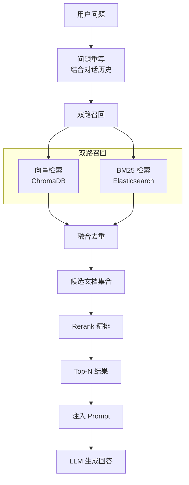

# 校灵通 (XLT)

> 基于 RAG 的校园智能问答系统，支持混合检索、角色权限管理和多知识库隔离。

## 项目简介

校灵通是一个面向校园场景的智能问答平台，采用**检索增强生成（RAG）**技术，结合**向量检索**与**BM25 全文检索**的混合检索方案，为师生提供精准、可靠的知识问答服务。系统支持多知识库管理、角色权限隔离、公告发布等功能。

注：该readme文件由AI生成，仅供参考。

## 技术栈

### 后端
- **框架**: FastAPI + Uvicorn
- **数据库**: MySQL
- **向量数据库**: ChromaDB
- **全文检索**: Elasticsearch 8.x
- **AI 模型**:
  - 对话模型: DeepSeek-V3.2 (SiliconFlow)
  - 向量模型: Qwen/Qwen3-Embedding-8B
  - 重排模型: Qwen/Qwen3-Reranker-8B
- **认证**: JWT (PyJWT)
- **文件处理**: pdfplumber, python-docx
- **对象存储**: 阿里云 OSS
- **包管理**: uv

### 前端
- **框架**: Vue 3 + Vite
- **UI 组件库**: Element Plus
- **路由**: Vue Router 4
- **状态管理**: Pinia (含持久化)
- **HTTP 客户端**: Axios
- **Markdown 渲染**: markdown-it

## 项目结构

```
xlt/
├── ai/                      # AI 服务层
│   ├── chat.py             # 聊天服务（对话、总结、恶意检测、问题重写）
│   ├── chroma_service.py   # Chroma 向量数据库服务
│   ├── embedding.py        # 文本向量化服务
│   ├── es_service.py       # Elasticsearch BM25 检索服务
│   ├── hybrid_search_service.py  # 混合检索服务（向量+BM25+Rerank）
│   ├── ingestion_service.py      # 文档入库服务（双写 Chroma + ES）
│   └── rerank_service.py   # 重排服务
├── authentication/          # 认证模块
│   ├── authentication.py   # 认证路由与 JWT 依赖
│   └── user_auth.py        # 用户权限校验装饰器
├── config/                  # 配置模块
│   ├── ai_config.py        # AI 相关配置
│   ├── db_config.py        # 数据库配置
│   ├── file_config.py      # 文件配置
│   ├── jwt_config.py       # JWT 配置
│   └── oss_config.py       # 阿里云 OSS 配置
├── crud/                    # 数据访问层
│   ├── announcement_*.py   # 公告及附件 CRUD
│   ├── document_crud.py    # 文档 CRUD
│   ├── knowledge_base_crud.py  # 知识库 CRUD
│   ├── message_crud.py     # 消息 CRUD
│   ├── role_*.py           # 角色及关联 CRUD
│   ├── session_crud.py     # 会话 CRUD
│   └── user_*.py           # 用户及关联 CRUD
├── model/                   # 数据模型层
│   ├── result.py           # 统一响应结果
│   └── *.py                # 各业务模型
├── router/                  # 路由层
│   └── *_router.py         # 各业务模块路由
├── sql/                     # 数据库脚本
│   └── db.sql              # 建表及初始化数据
├── util/                    # 工具类
│   ├── db_util.py          # 数据库工具
│   ├── file_util.py        # 文件处理工具（PDF/DOCX 解析、文本切片）
│   ├── jwt_util.py         # JWT 工具
│   └── oss_util.py         # OSS 工具
├── frontend/                # 前端项目
│   ├── src/
│   │   ├── api/            # API 接口封装
│   │   ├── views/          # 页面视图
│   │   │   ├── admin/      # 管理员页面
│   │   │   ├── chat/       # 聊天页面
│   │   │   └── user/       # 普通用户页面
│   │   ├── router/         # 路由配置
│   │   ├── hooks/          # 自定义 Hooks
│   │   ├── utils/          # 工具函数
│   │   └── assets/         # 静态资源
│   ├── vite.config.js      # Vite 配置
│   └── package.json
├── main.py                  # 应用入口
├── pyproject.toml           # Python 项目配置
└── README.md
```

## 核心功能

### 1. 智能问答（RAG）
- **混合检索**: 向量检索（ChromaDB）+ BM25 全文检索（Elasticsearch）双路召回
- **精排重排**: 使用 Reranker 模型对召回结果进行精排
- **问题重写**: 结合对话历史重写用户问题，提升检索准确率
- **对话总结**: 自动生成会话标题
- **安全检测**: 恶意内容检测过滤
- **Markdown 输出**: 回答支持 Markdown 格式渲染

### 2. 知识库管理
- 多知识库创建与管理
- 文档上传与解析（支持 PDF、DOCX）
- 文本自动切片与向量化
- 双写同步（ChromaDB + Elasticsearch）
- 文档删除与知识库清理

### 3. 角色与权限
- 角色管理（新芒、教职工、学生等）
- 用户-角色关联
- 角色-知识库关联（权限隔离）
- 管理员/普通用户两级权限

### 4. 会话管理
- 多会话创建与切换
- 会话历史保存
- 会话重命名与删除

### 5. 公告系统
- 公告发布与管理
- 附件上传
- 置顶功能

## 数据库设计

核心数据表：

| 表名 | 说明 |
|------|------|
| `user` | 用户表 |
| `role` | 角色表 |
| `role_user` | 角色-用户关联表 |
| `knowledge_base` | 知识库表 |
| `role_knowledge_base` | 角色-知识库关联表 |
| `user_knowledge_base` | 用户-知识库关联表 |
| `document` | 文档表 |
| `session` | 会话表 |
| `message` | 消息表 |
| `announcement` | 公告表 |
| `announcement_attachment` | 公告附件表 |

## 快速开始

### 环境要求
- Python >= 3.11
- Node.js >= 22.18.0
- MySQL
- Elasticsearch 8.x
- uv（Python 包管理器）

### 后端启动

1. **克隆项目**
   ```bash
   git clone <repository-url>
   cd xlt
   ```

2. **安装依赖**
   ```bash
   uv sync
   ```

3. **配置数据库**

   修改 `config/db_config.py` 中的数据库连接信息，然后执行初始化脚本：
   ```bash
   mysql -u root -p < sql/db.sql
   ```

4. **配置 AI 服务**

   修改 `config/ai_config.py` 中的 API Key 和模型配置。

5. **启动服务**
   ```bash
   uv run uvicorn main:app --reload --host 0.0.0.0 --port 8000
   ```

   API 文档访问: http://localhost:8000/docs

### 前端启动

1. **进入前端目录**
   ```bash
   cd frontend
   ```

2. **安装依赖**
   ```bash
   npm install
   ```

3. **启动开发服务器**
   ```bash
   npm run dev
   ```

4. **构建生产版本**
   ```bash
   npm run build
   ```

### 默认账号

| 用户名 | 密码 | 角色 |
|--------|------|------|
| admin | 123456 | 管理员 |
| hajimi | 123456 | 学生 |

## API 模块

- **认证**: `/api/auth` - 登录认证
- **用户**: `/api/user` - 用户管理
- **角色**: `/api/role` - 角色管理
- **知识库**: `/api/knowledge-base` - 知识库管理
- **文档**: `/api/document` - 文档上传与管理
- **会话**: `/api/session` - 会话管理
- **消息**: `/api/message` - 消息与问答
- **公告**: `/api/announcement` - 公告管理
- **附件**: `/api/announcement-attachment` - 公告附件

## 混合检索流程


