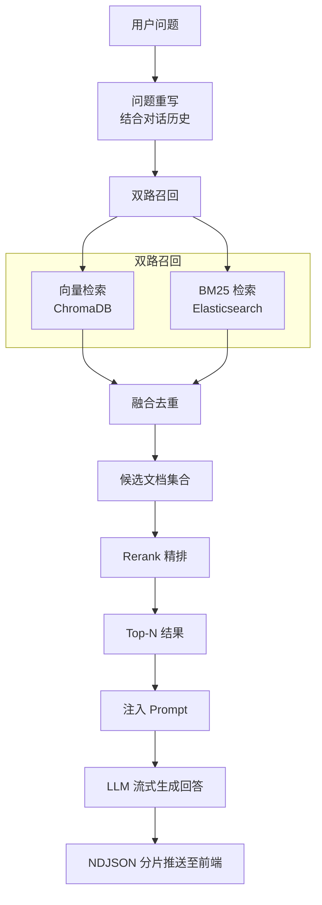

# 校灵通（XLT）

[简体中文](README.md) | [English](README-en.md)

> 基于 RAG 的校园智能问答系统，支持混合检索、角色权限管理和多知识库隔离。

> [!WARNING]
> 本 README 由 AI 生成，尚未经人工检查，内容仅供参考；实际行为请以项目源码为准。

## 目录

- [校灵通（XLT）](#校灵通xlt)
  - [项目简介](#项目简介)
  - [技术栈](#技术栈)
    - [后端](#后端)
    - [前端](#前端)
  - [项目结构](#项目结构)
  - [核心功能](#核心功能)
    - [1. 智能问答（RAG）](#1-智能问答rag)
    - [2. 知识库管理](#2-知识库管理)
    - [3. 角色与权限](#3-角色与权限)
    - [4. 会话管理](#4-会话管理)
    - [5. 公告系统](#5-公告系统)
  - [数据库设计](#数据库设计)
  - [快速开始](#快速开始)
    - [环境要求](#环境要求)
    - [1. 安装后端依赖](#1-安装后端依赖)
    - [2. 配置环境变量](#2-配置环境变量)
    - [3. 初始化数据库](#3-初始化数据库)
    - [4. 启动后端](#4-启动后端)
    - [5. 启动前端](#5-启动前端)
    - [默认账号](#默认账号)
  - [文件与模型限制](#文件与模型限制)
  - [API 模块](#api-模块)
    - [聊天流式响应](#聊天流式响应)
    - [生成 Markdown 接口文档](#生成-markdown-接口文档)
  - [自动化测试](#自动化测试)
  - [混合检索流程](#混合检索流程)
  - [开发与部署注意事项](#开发与部署注意事项)

## 项目简介

校灵通是一个面向校园场景的智能问答与知识管理系统。后端使用 FastAPI，前端使用 Vue 3；问答链路结合 ChromaDB 向量检索、Elasticsearch BM25 检索和 Rerank 重排，并通过角色关联控制用户可访问的知识库。

## 技术栈

### 后端
- **框架**: FastAPI + Uvicorn + Pydantic 2
- **数据库**: MySQL
- **向量数据库**: ChromaDB
- **全文检索**: Elasticsearch 8.x + IK 中文分词器
- **AI 模型**:
  - 对话模型: DeepSeek-V3.2 (SiliconFlow)
  - 向量模型: Qwen/Qwen3-Embedding-8B
  - 重排模型: Qwen/Qwen3-Reranker-8B
- **认证**: JWT (PyJWT)、Argon2id 密码哈希
- **文件处理**: pdfplumber, python-docx
- **对象存储**: 阿里云 OSS
- **包管理**: uv

### 前端
- **框架**: Vue 3 + Vite
- **UI 组件库**: Element Plus
- **路由**: Vue Router 4
- **状态管理**: Pinia 4（含持久化）
- **HTTP 客户端**: Axios；聊天接口使用 Fetch Streams 读取流式响应
- **Markdown 渲染**: markdown-it

## 项目结构

```
xlt/
├── ai/                      # AI 服务层
│   ├── chat.py             # 聊天服务（流式对话、总结、恶意检测、问题重写）
│   ├── chroma_service.py   # Chroma 向量数据库服务
│   ├── embedding.py        # 文本向量化服务
│   ├── es_service.py       # Elasticsearch BM25 检索服务
│   ├── hybrid_search_service.py  # 混合检索服务（向量+BM25+Rerank）
│   ├── ingestion_service.py      # 文档入库服务（双写 Chroma + ES）
│   └── rerank_service.py   # 重排服务
├── authentication/          # 认证模块
│   ├── authentication.py   # 认证路由与当前用户依赖
│   └── user_auth.py        # 用户与管理员权限依赖
├── config/                  # 配置模块
│   ├── __init__.py         # 加载项目根目录的 .env
│   ├── ai_config.py        # AI 相关配置
│   ├── prompts/            # AI 提示词模板
│   │   ├── malicious_check.md  # 恶意与敏感内容检查
│   │   ├── rewrite.md      # 用户问题重写
│   │   ├── summary.md      # 会话标题总结
│   │   └── system.md       # 知识库问答系统提示词
│   ├── db_config.py        # 数据库配置
│   ├── file_config.py      # 文件配置
│   ├── jwt_config.py       # JWT 配置
│   └── oss_config.py       # 阿里云 OSS 配置
├── crud/                    # 数据访问层
│   ├── announcement_*.py   # 公告及附件 CRUD
│   ├── document_crud.py    # 文档 CRUD
│   ├── knowledge_base_crud.py  # 知识库 CRUD
│   ├── message_crud.py     # 消息 CRUD
│   ├── role_*.py           # 角色及关联 CRUD
│   ├── session_crud.py     # 会话 CRUD
│   └── user_*.py           # 用户及关联 CRUD
├── model/                   # 数据模型层
│   ├── result.py           # 统一响应结果
│   └── *_model.py          # Pydantic 业务模型
├── router/                  # 路由层
│   └── *_router.py         # 各业务模块路由
├── scripts/
│   ├── generate_api_doc.py         # Markdown 接口文档生成脚本
│   └── generate_argon2_password.py # 明文密码 Argon2id 转换脚本
├── sql/                     # 数据库脚本
│   ├── db.sql              # 非破坏性建表及初始化数据
│   └── reset-dev.sql       # 仅限开发环境的数据库清理脚本
├── util/                    # 工具类
│   ├── db_util.py          # 数据库工具
│   ├── file_util.py        # 文件处理工具（PDF/DOCX 解析、文本切片）
│   ├── jwt_util.py         # JWT 工具
│   ├── password_util.py    # Argon2id 密码哈希与验证工具
│   └── oss_util.py         # OSS 工具
├── frontend/                # 前端项目
│   ├── src/
│   │   ├── api/            # API 接口封装
│   │   ├── views/          # 页面视图
│   │   │   ├── admin/      # 管理员页面
│   │   │   ├── chat/       # 聊天页面
│   │   │   └── user/       # 普通用户页面
│   │   ├── router/         # 路由配置
│   │   ├── hooks/          # 自定义 Hooks
│   │   ├── utils/          # 工具函数
│   │   └── assets/         # 静态资源
│   ├── vite.config.js      # Vite 配置
│   └── package.json
├── main.py                  # 应用入口
├── .env.example             # 环境变量模板（不含真实凭证）
├── AGENTS.md                # 编码代理的项目工作约定
├── pyproject.toml           # Python 项目配置
├── 接口文档.md              # 自动生成的接口文档
├── README.md                # 中文说明文档
└── README-en.md             # 英文说明文档
```

ChromaDB 的持久化数据默认写入项目根目录的 `chroma_db/`，该目录已被 Git 忽略。

## 核心功能

### 1. 智能问答（RAG）
- **混合检索**: 向量检索（ChromaDB）+ BM25 全文检索（Elasticsearch）双路召回
- **精排重排**: 使用 Reranker 模型对召回结果进行精排
- **问题重写**: 结合对话历史重写用户问题，提升检索准确率
- **对话总结**: 自动生成会话标题
- **安全检测**: 恶意内容检测过滤
- **流式回答**: AI 生成内容通过 NDJSON 逐段推送并实时显示
- **Markdown 输出**: 回答支持 Markdown 格式渲染

### 2. 知识库管理
- 多知识库创建与管理
- 文档上传与解析（支持 Markdown、TXT、PDF、DOCX）
- 文本自动切片与向量化
- 双写同步（ChromaDB + Elasticsearch）
- 文档删除与知识库清理

### 3. 角色与权限
- 角色管理（新芒、教职工、学生等）
- 用户-角色关联
- 角色-知识库关联（按 `user -> role -> knowledge_base` 关系计算访问权限）
- 管理员/普通用户两级权限

### 4. 会话管理
- 多会话创建与切换
- 点击“创建对话”仅进入空白对话，发送第一条消息时才创建并保存会话
- 会话历史保存
- 会话重命名与删除

### 5. 公告系统
- 公告发布与管理
- 附件上传
- 置顶功能

## 数据库设计

核心数据表：

| 表名 | 说明 |
|------|------|
| `user` | 用户表 |
| `role` | 角色表 |
| `role_user` | 角色-用户关联表 |
| `knowledge_base` | 知识库表 |
| `role_knowledge_base` | 角色-知识库关联表 |
| `document` | 文档表 |
| `session` | 会话表 |
| `message` | 消息表 |
| `announcement` | 公告表 |
| `announcement_attachment` | 公告附件表 |

项目不存在独立的用户—知识库关联表。用户可访问的知识库通过 `role_user` 和 `role_knowledge_base` 两张关联表联查获得。

## 快速开始

### 环境要求

- Python >= 3.11
- Node.js `^22.18.0` 或 `>=24.12.0`
- MySQL
- Elasticsearch 8.x（需要 IK 中文分词插件）
- uv（Python 包管理器）
- 可访问的 SiliconFlow API
- 阿里云 OSS Bucket

### 1. 安装后端依赖

```bash
uv sync
```

### 2. 配置环境变量

复制环境变量模板：

```powershell
# PowerShell
Copy-Item .env.example .env
```

```bash
# Bash
cp .env.example .env
```

编辑项目根目录的 `.env`，填写以下配置：

| 变量 | 说明 |
| --- | --- |
| `DB_HOST` | MySQL 主机地址 |
| `DB_PORT` | MySQL 端口，默认 `3306` |
| `DB_USER` | MySQL 用户名 |
| `DB_PASSWORD` | MySQL 密码 |
| `DB_NAME` | MySQL 数据库名 |
| `JWT_SECRET_KEY` | JWT 签名密钥，应使用足够长的随机值 |
| `ES_HOST` | Elasticsearch 主机地址 |
| `ES_PORT` | Elasticsearch 端口，默认 `9200` |
| `CHAT_API_KEY` | 正式聊天回答服务 API Key |
| `UTILITY_API_KEY` | 问题重写、恶意检查和标题总结服务 API Key |
| `EMBEDDING_API_KEY` | 向量化服务 API Key |
| `RERANK_API_KEY` | 精排服务 API Key |
| `OSS_ACCESS_KEY_ID` | 阿里云 OSS AccessKey ID |
| `OSS_ACCESS_KEY_SECRET` | 阿里云 OSS AccessKey Secret |

项目启动时会自动加载根目录的 `.env`。如果系统环境中已经存在同名变量，系统环境变量优先，不会被 `.env` 覆盖。

当前 `sql/db.sql` 固定创建并使用名为 `xlt` 的数据库，因此使用该初始化脚本时，`.env` 中的 `DB_NAME` 必须设置为 `xlt`。如果需要使用其他数据库名，应同时修改初始化脚本中的 `create database` 和 `use` 语句。

`.env` 已被 Git 忽略，请勿强制提交；`.env.example` 仅用于记录变量名，不应包含真实凭证。模型名称、召回参数、文件限制、OSS Bucket 和 Endpoint 等非敏感配置仍保留在 `config/` 下对应模块中。

正式回答使用 `CHAT_API_KEY`，问题重写、恶意检查和标题总结使用独立的 `UTILITY_API_KEY`。聊天、辅助任务、向量化和精排的服务地址分别由 `config/ai_config.py` 中的 `CHAT_BASE_URL`、`UTILITY_BASE_URL`、`EMBEDDING_BASE_URL` 和 `RERANK_BASE_URL` 配置，并非环境变量；当前均指向 SiliconFlow。辅助模型默认为 `Qwen/Qwen3-8B`，模型名称与生成参数也可在该配置文件中修改。

AI 提示词正文存放在 `config/prompts/` 下，并由 `config/ai_config.py` 以 UTF-8 编码加载。`system.md` 用于知识库问答，`summary.md` 用于生成会话标题，`malicious_check.md` 用于内容安全检查，`rewrite.md` 用于结合历史对话重写问题。编辑模板时请保留 `{conversation}`、`{user_input}`、`{conversation_history}` 和 `{user_question}` 等运行时占位符。

Elasticsearch 创建知识库索引时会使用 `ik_max_word` tokenizer。服务未安装 IK 插件时，文档索引会创建失败。

### 3. 初始化数据库

按照 `.env` 中的数据库配置登录 MySQL，并在项目根目录执行初始化脚本：

```bash
mysql -h localhost -P 3306 -u your_database_user -p
```

将示例中的主机、端口和用户名替换为 `.env` 中的对应值。

```text
SOURCE sql/db.sql;
```

`sql/db.sql` 仅用于空环境的首次初始化。脚本不会主动删除已有数据库、表或数据，但它不具备幂等性：建表语句和初始化数据插入不能在已完成初始化的数据库上重复执行。执行脚本的数据库账号需要具有创建数据库、创建表和插入数据的权限；已有数据库的结构变更应通过增量迁移完成。

需要清空并重建本地开发数据库时，依次执行：

```text
SOURCE sql/reset-dev.sql;
SOURCE sql/db.sql;
```

> [!WARNING]
> `sql/reset-dev.sql` 会删除整个 `xlt` 数据库，只能用于可以丢弃全部数据的本地开发环境；随后执行 `sql/db.sql` 才会重新创建数据库。

### 4. 启动后端

确保 MySQL 和 Elasticsearch 已启动，然后在项目根目录执行：

```bash
uv run uvicorn main:app --reload --host 0.0.0.0 --port 8000
```

启动后可访问：

- 服务根地址：<http://127.0.0.1:8000/>
- Swagger UI：<http://127.0.0.1:8000/docs>
- ReDoc：<http://127.0.0.1:8000/redoc>

### 5. 启动前端

```bash
cd frontend
npm install
npm run dev
```

Vite 开发服务器默认运行在 <http://127.0.0.1:5173>，并将前端的 `/api` 请求代理到 `http://127.0.0.1:8000`。

生产构建：

```bash
npm run build
```

构建结果输出到 `frontend/dist/`。

### 默认账号

| 用户名 | 密码 | 类型/角色 |
| --- | --- | --- |
| `admin` | `123456` | 管理员、新芒 |
| `hajimi` | `123456` | 普通用户、学生 |

## 文件与模型限制

- 上传格式：`.md`、`.txt`、`.pdf`、`.docx`
- 上传文件不能为空；单文件最大大小为 10 MB，恰好 10 MB 时允许上传
- 上传文件名：1–255 个字符；存储路径：1–500 个字符
- 前端和后端都会校验文件扩展名、大小、空文件及文件名长度
- OSS 下载链接默认有效期：300 秒
- 文本切片最大长度：500 字符，重叠长度：150 字符
- 用户名：4–15 个字符
- 密码：6–20 个字符
- 角色名、知识库名：1–15 个字符
- 会话名：1–20 个字符
- 公告标题：1–255 个字符；公告正文不能为空
- 聊天输入（仅前端界面）：上限为 2000 个字符，恰好 2000 个字符时允许发送；输入或粘贴的超限内容会自动截断。支持 `Intl.Segmenter` 时按 Unicode 字素簇计数，否则回退到 Unicode 码点计数
- 管理员状态：`0` 或 `1`
- 公告置顶值：`0` 或 `1`
- 消息角色：`user` 或 `assistant`

实体 ID 和关联 ID 必须为正整数。名称唯一性、关联对象是否存在、访问权限以及上传文件内容等校验由 Router、CRUD 和数据库共同完成。

## API 模块

| 模块 | 路径 | 说明 |
| --- | --- | --- |
| OAuth2 认证 | `/api/auth` | Swagger OAuth2 表单登录 |
| 用户 | `/api/user` | 普通用户注册、登录、用户资料和管理员操作 |
| 角色 | `/api/role` | 角色增删改查 |
| 用户角色 | `/api/role_user` | 用户与角色关联 |
| 知识库 | `/api/knowledge_base` | 知识库管理 |
| 角色知识库 | `/api/role_knowledge_base` | 角色与知识库关联 |
| 用户可访问知识库 | `/api/user_knowledge_base` | 按角色关系查询访问范围 |
| 文档 | `/api/document` | 上传、下载、索引和删除 |
| 会话 | `/api/session` | 会话创建、查询、改名和删除 |
| 消息 | `/api/message` | RAG 问答和消息管理 |
| 公告 | `/api/announcement` | 公告发布、查询和置顶 |
| 公告附件 | `/api/announcement_attachment` | 附件上传、下载和删除 |

`POST /api/user/register` 是公开的普通用户注册接口，只接受用户名和密码，且不能设置管理员权限。`POST /api/user/register-admin` 用于管理员创建用户，需要管理员身份认证，并可设置用户是否为管理员。

普通用户注册、登录和认证接口无需身份认证；管理员注册及其他业务接口通常需要请求头：

```http
Authorization: Bearer <access-token>
```

普通业务接口的业务响应由 `Result` 包装：成功时 `code` 为 `1`，失败时 `code` 为 `0`，同时返回 `msg` 和 `data`。OAuth2 的 `/api/auth` 成功时直接返回 `access_token` 和 `token_type`；认证失败、请求参数校验失败等框架级错误使用 FastAPI 的标准 JSON 错误格式。`POST /api/message/chat` 建流前的业务错误返回 `Result`，成功建立流后则使用 `application/x-ndjson` 逐行输出 `start`、`delta`、`done` 或 `error` 事件，各事件的具体内容见下节。

### 聊天流式响应

`POST /api/message/chat` 使用 `application/x-ndjson` 返回流式响应。请求仍需携带 Bearer Token，请求体示例：

```json
{
  "session_id": 1,
  "role": "user",
  "content": "学校图书馆几点关闭？",
  "create_time": "2026-08-20T16:00:00.000Z"
}
```

响应体的每一行都是一个独立 JSON 事件：

| 事件类型 | 字段 | 说明 |
| --- | --- | --- |
| `start` | `user_message_id` | 用户消息已保存，返回其数据库 ID |
| `delta` | `content` | AI 本次生成的文本片段，可直接追加到当前回复 |
| `done` | `assistant_message_id` | AI 回复生成完成并已保存，返回其数据库 ID |
| `error` | `message` | 生成过程失败；不保存不完整的 AI 回复 |

示例响应：

```ndjson
{"type":"start","user_message_id":101}
{"type":"delta","content":"学校图书馆"}
{"type":"delta","content":"通常在晚上 22:00 关闭。"}
{"type":"done","assistant_message_id":102}
```

可使用 `curl -N` 关闭客户端输出缓冲并观察响应过程：

```bash
curl -N http://127.0.0.1:8000/api/message/chat \
  -H "Authorization: Bearer <access-token>" \
  -H "Content-Type: application/json" \
  -H "Accept: application/x-ndjson" \
  -d '{"session_id":1,"role":"user","content":"学校图书馆几点关闭？","create_time":"2026-08-20T16:00:00.000Z"}'
```

浏览器端使用 `fetch()` 获取 `response.body`，通过 `ReadableStream` 和 `TextDecoder` 按行解析事件。流式消息对象必须保持 Vue 响应式，收到 `delta` 后将 `content` 追加到当前 AI 消息即可实时更新页面。

会话权限或请求参数等在建立流之前发生的错误仍返回普通 JSON；流开始后的生成错误通过 `error` 事件返回。用户消息在生成前保存，AI 消息仅在完整生成后保存。

### 生成 Markdown 接口文档

```bash
uv run python scripts/generate_api_doc.py
```

脚本从 FastAPI OpenAPI Schema 读取当前路由，并覆盖生成项目根目录的 `接口文档.md`。该文件提供路径、参数、请求体以及 OpenAPI 可推导的响应模型摘要；聊天流的媒体类型、事件字段与处理时序以本 README 的“聊天流式响应”一节为准。

## 自动化测试

首次运行前同步开发依赖，然后执行测试：

```bash
uv sync --group dev
uv run pytest -q
```

当前测试覆盖会话和消息的资源归属、管理员权限、聊天 NDJSON 事件顺序、生成失败时的消息持久化、文本切片和密码校验。API 测试使用内存替身隔离 CRUD、检索和模型服务，默认不会连接或修改 MySQL、Elasticsearch、OSS、ChromaDB 和模型 API。

## 混合检索流程



## 开发与部署注意事项

- 使用 Codex 等编码代理参与开发时，应遵循根目录 `AGENTS.md` 中的工程约定、安全边界、验证要求和 Git 规范。
- 用户密码使用 Argon2id 哈希保存和验证；已有明文密码的数据库需要先迁移或重置密码，不能直接沿用。
- 必须为 `JWT_SECRET_KEY` 配置独立且足够强的随机值，并避免将 `.env`、数据库密码、API Key 和 OSS 凭证提交到版本库。
- 后端当前未配置 CORS；本地开发依赖 Vite 代理。前后端跨域独立部署时，需要增加可信来源的 CORS 配置或由反向代理统一域名。
- 反向代理必须关闭 `/api/message/chat` 的响应缓冲和缓存，否则浏览器可能在生成结束后才一次性收到全部内容。后端已返回 `X-Accel-Buffering: no` 和 `Cache-Control: no-cache`，使用 Nginx 时仍应确认代理配置未覆盖这些行为。
- 文档上传会依次写入 OSS、MySQL、ChromaDB 和 Elasticsearch。生产环境应补充失败补偿、事务一致性和可观测性。
- 删除知识库、文档或公告附件会同步操作外部存储和索引，执行前应确认对应服务可用并做好备份。
