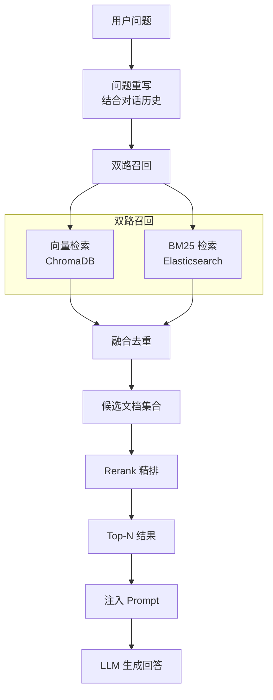

# 校灵通（XLT）

[简体中文](README.md) | [English](README-en.md)

> 基于 RAG 的校园智能问答系统，支持混合检索、角色权限管理和多知识库隔离。

> [!WARNING]
> 本 README 由 AI 生成，尚未经人工检查，内容仅供参考；实际行为请以项目源码为准。

## 目录

- [校灵通（XLT）](#校灵通xlt)
  - [项目简介](#项目简介)
  - [技术栈](#技术栈)
    - [后端](#后端)
    - [前端](#前端)
  - [项目结构](#项目结构)
  - [核心功能](#核心功能)
    - [1. 智能问答（RAG）](#1-智能问答rag)
    - [2. 知识库管理](#2-知识库管理)
    - [3. 角色与权限](#3-角色与权限)
    - [4. 会话管理](#4-会话管理)
    - [5. 公告系统](#5-公告系统)
  - [数据库设计](#数据库设计)
  - [快速开始](#快速开始)
    - [环境要求](#环境要求)
    - [1. 安装后端依赖](#1-安装后端依赖)
    - [2. 初始化数据库](#2-初始化数据库)
    - [3. 配置外部服务](#3-配置外部服务)
    - [4. 启动后端](#4-启动后端)
    - [5. 启动前端](#5-启动前端)
    - [默认账号](#默认账号)
  - [文件与模型限制](#文件与模型限制)
  - [API 模块](#api-模块)
    - [生成 Markdown 接口文档](#生成-markdown-接口文档)
  - [混合检索流程](#混合检索流程)
  - [开发与部署注意事项](#开发与部署注意事项)

## 项目简介

校灵通是一个面向校园场景的智能问答与知识管理系统。后端使用 FastAPI，前端使用 Vue 3；问答链路结合 ChromaDB 向量检索、Elasticsearch BM25 检索和 Rerank 重排，并通过角色关联控制用户可访问的知识库。

## 技术栈

### 后端
- **框架**: FastAPI + Uvicorn + Pydantic 2
- **数据库**: MySQL
- **向量数据库**: ChromaDB
- **全文检索**: Elasticsearch 8.x + IK 中文分词器
- **AI 模型**:
  - 对话模型: DeepSeek-V3.2 (SiliconFlow)
  - 向量模型: Qwen/Qwen3-Embedding-8B
  - 重排模型: Qwen/Qwen3-Reranker-8B
- **认证**: JWT (PyJWT)、Argon2id 密码哈希
- **文件处理**: pdfplumber, python-docx
- **对象存储**: 阿里云 OSS
- **包管理**: uv

### 前端
- **框架**: Vue 3 + Vite
- **UI 组件库**: Element Plus
- **路由**: Vue Router 4
- **状态管理**: Pinia 4（含持久化）
- **HTTP 客户端**: Axios
- **Markdown 渲染**: markdown-it

## 项目结构

```
xlt/
├── ai/                      # AI 服务层
│   ├── chat.py             # 聊天服务（对话、总结、恶意检测、问题重写）
│   ├── chroma_service.py   # Chroma 向量数据库服务
│   ├── embedding.py        # 文本向量化服务
│   ├── es_service.py       # Elasticsearch BM25 检索服务
│   ├── hybrid_search_service.py  # 混合检索服务（向量+BM25+Rerank）
│   ├── ingestion_service.py      # 文档入库服务（双写 Chroma + ES）
│   └── rerank_service.py   # 重排服务
├── authentication/          # 认证模块
│   ├── authentication.py   # 认证路由与 JWT 依赖
│   └── user_auth.py        # 用户权限校验装饰器
├── config/                  # 配置模块
│   ├── ai_config.py        # AI 相关配置
│   ├── db_config.py        # 数据库配置
│   ├── file_config.py      # 文件配置
│   ├── jwt_config.py       # JWT 配置
│   └── oss_config.py       # 阿里云 OSS 配置
├── crud/                    # 数据访问层
│   ├── announcement_*.py   # 公告及附件 CRUD
│   ├── document_crud.py    # 文档 CRUD
│   ├── knowledge_base_crud.py  # 知识库 CRUD
│   ├── message_crud.py     # 消息 CRUD
│   ├── role_*.py           # 角色及关联 CRUD
│   ├── session_crud.py     # 会话 CRUD
│   └── user_*.py           # 用户及关联 CRUD
├── model/                   # 数据模型层
│   ├── result.py           # 统一响应结果
│   └── *_model.py          # Pydantic 业务模型
├── router/                  # 路由层
│   └── *_router.py         # 各业务模块路由
├── scripts/
│   ├── generate_api_doc.py         # Markdown 接口文档生成脚本
│   └── generate_argon2_password.py # 明文密码 Argon2id 转换脚本
├── sql/                     # 数据库脚本
│   ├── db.sql              # 非破坏性建表及初始化数据
│   └── reset-dev.sql       # 仅限开发环境的数据库重置脚本
├── util/                    # 工具类
│   ├── db_util.py          # 数据库工具
│   ├── file_util.py        # 文件处理工具（PDF/DOCX 解析、文本切片）
│   ├── jwt_util.py         # JWT 工具
│   ├── password_util.py    # Argon2id 密码哈希与验证工具
│   └── oss_util.py         # OSS 工具
├── frontend/                # 前端项目
│   ├── src/
│   │   ├── api/            # API 接口封装
│   │   ├── views/          # 页面视图
│   │   │   ├── admin/      # 管理员页面
│   │   │   ├── chat/       # 聊天页面
│   │   │   └── user/       # 普通用户页面
│   │   ├── router/         # 路由配置
│   │   ├── hooks/          # 自定义 Hooks
│   │   ├── utils/          # 工具函数
│   │   └── assets/         # 静态资源
│   ├── vite.config.js      # Vite 配置
│   └── package.json
├── main.py                  # 应用入口
├── pyproject.toml           # Python 项目配置
├── 接口文档.md              # 自动生成的接口文档
└── README.md
```

ChromaDB 的持久化数据默认写入项目根目录的 `chroma_db/`，该目录已被 Git 忽略。

## 核心功能

### 1. 智能问答（RAG）
- **混合检索**: 向量检索（ChromaDB）+ BM25 全文检索（Elasticsearch）双路召回
- **精排重排**: 使用 Reranker 模型对召回结果进行精排
- **问题重写**: 结合对话历史重写用户问题，提升检索准确率
- **对话总结**: 自动生成会话标题
- **安全检测**: 恶意内容检测过滤
- **Markdown 输出**: 回答支持 Markdown 格式渲染

### 2. 知识库管理
- 多知识库创建与管理
- 文档上传与解析（支持 Markdown、TXT、PDF、DOCX）
- 文本自动切片与向量化
- 双写同步（ChromaDB + Elasticsearch）
- 文档删除与知识库清理

### 3. 角色与权限
- 角色管理（新芒、教职工、学生等）
- 用户-角色关联
- 角色-知识库关联（按 `user -> role -> knowledge_base` 关系计算访问权限）
- 管理员/普通用户两级权限

### 4. 会话管理
- 多会话创建与切换
- 会话历史保存
- 会话重命名与删除

### 5. 公告系统
- 公告发布与管理
- 附件上传
- 置顶功能

## 数据库设计

核心数据表：

| 表名 | 说明 |
|------|------|
| `user` | 用户表 |
| `role` | 角色表 |
| `role_user` | 角色-用户关联表 |
| `knowledge_base` | 知识库表 |
| `role_knowledge_base` | 角色-知识库关联表 |
| `document` | 文档表 |
| `session` | 会话表 |
| `message` | 消息表 |
| `announcement` | 公告表 |
| `announcement_attachment` | 公告附件表 |

项目不存在独立的用户—知识库关联表。用户可访问的知识库通过 `role_user` 和 `role_knowledge_base` 两张关联表联查获得。

## 快速开始

### 环境要求

- Python >= 3.11
- Node.js `^22.18.0` 或 `>=24.12.0`
- MySQL
- Elasticsearch 8.x（需要 IK 中文分词插件）
- uv（Python 包管理器）
- 可访问的 SiliconFlow API
- 阿里云 OSS Bucket

### 1. 安装后端依赖

```bash
uv sync
```

### 2. 初始化数据库

先修改 `config/db_config.py` 中的 MySQL 连接信息，然后在项目根目录登录 MySQL 并执行初始化脚本：

```bash
mysql -u root -p
```

```sql
SOURCE sql/db.sql;
```

`sql/db.sql` 用于首次初始化，不会删除已有数据库、表或数据。已有数据库的结构变更应通过增量迁移完成。

需要清空并重建本地开发数据库时，执行：

```sql
SOURCE sql/reset-dev.sql;
```

> [!WARNING]
> `sql/reset-dev.sql` 会删除并重新创建整个 `xlt` 数据库，只能用于可以丢弃全部数据的本地开发环境。

### 3. 配置外部服务

| 文件 | 配置内容 |
| --- | --- |
| `config/db_config.py` | MySQL 地址、端口、账号和数据库名 |
| `config/ai_config.py` | SiliconFlow 地址、模型、召回数量、Elasticsearch 地址和端口 |
| `config/jwt_config.py` | JWT 签名密钥、算法和有效期 |
| `config/oss_config.py` | OSS Bucket、Endpoint 和 Region |
| `config/file_config.py` | 文件类型、上传大小、下载链接有效期和切片参数 |

AI 与 OSS 凭证从系统环境变量读取。PowerShell 示例：

```powershell
$env:OPENAI_API_KEY = "your-siliconflow-api-key"
$env:OSS_ACCESS_KEY_ID = "your-oss-access-key-id"
$env:OSS_ACCESS_KEY_SECRET = "your-oss-access-key-secret"
```

Bash 示例：

```bash
export OPENAI_API_KEY="your-siliconflow-api-key"
export OSS_ACCESS_KEY_ID="your-oss-access-key-id"
export OSS_ACCESS_KEY_SECRET="your-oss-access-key-secret"
```

项目没有自动加载 `.env` 文件，因此仅创建 `.env` 不会让这些变量生效。

Elasticsearch 创建知识库索引时会使用 `ik_max_word` tokenizer。服务未安装 IK 插件时，文档索引会创建失败。

### 4. 启动后端

确保 MySQL 和 Elasticsearch 已启动，然后在项目根目录执行：

```bash
uv run uvicorn main:app --reload --host 0.0.0.0 --port 8000
```

启动后可访问：

- 服务根地址：<http://127.0.0.1:8000/>
- Swagger UI：<http://127.0.0.1:8000/docs>
- ReDoc：<http://127.0.0.1:8000/redoc>

### 5. 启动前端

```bash
cd frontend
npm install
npm run dev
```

Vite 开发服务器默认运行在 <http://127.0.0.1:5173>，并将前端的 `/api` 请求代理到 `http://127.0.0.1:8000`。

生产构建：

```bash
npm run build
```

构建结果输出到 `frontend/dist/`。

### 默认账号

| 用户名 | 密码 | 类型/角色 |
| --- | --- | --- |
| `admin` | `123456` | 管理员、新芒 |
| `hajimi` | `123456` | 普通用户、学生 |

## 文件与模型限制

- 上传格式：`.md`、`.txt`、`.pdf`、`.docx`
- 单文件最大大小：10 MB
- OSS 下载链接默认有效期：300 秒
- 文本切片最大长度：500 字符，重叠长度：150 字符
- 用户名：4–15 个字符
- 密码：6–20 个字符
- 角色名、知识库名：1–15 个字符
- 会话名：1–20 个字符
- 公告置顶值：`0` 或 `1`
- 消息角色：`user` 或 `assistant`

实体 ID 和关联 ID 必须为正整数。名称唯一性、关联对象是否存在、访问权限以及上传文件内容等校验由 Router、CRUD 和数据库共同完成。

## API 模块

| 模块 | 路径 | 说明 |
| --- | --- | --- |
| OAuth2 认证 | `/api/auth` | Swagger OAuth2 表单登录 |
| 用户 | `/api/user` | 注册、登录、用户资料和管理员操作 |
| 角色 | `/api/role` | 角色增删改查 |
| 用户角色 | `/api/role_user` | 用户与角色关联 |
| 知识库 | `/api/knowledge_base` | 知识库管理 |
| 角色知识库 | `/api/role_knowledge_base` | 角色与知识库关联 |
| 用户可访问知识库 | `/api/user_knowledge_base` | 按角色关系查询访问范围 |
| 文档 | `/api/document` | 上传、下载、索引和删除 |
| 会话 | `/api/session` | 会话创建、查询、改名和删除 |
| 消息 | `/api/message` | RAG 问答和消息管理 |
| 公告 | `/api/announcement` | 公告发布、查询和置顶 |
| 公告附件 | `/api/announcement_attachment` | 附件上传、下载和删除 |

除注册、登录和认证接口外，业务接口通常需要请求头：

```http
Authorization: Bearer <access-token>
```

业务响应由 `Result` 统一包装：成功时 `code` 为 `1`，失败时 `code` 为 `0`，同时返回 `msg` 和 `data`。

### 生成 Markdown 接口文档

```bash
uv run python scripts/generate_api_doc.py
```

脚本从 FastAPI OpenAPI Schema 读取当前路由，并覆盖生成项目根目录的 `接口文档.md`。完整的路径、参数、请求体和响应说明请查看该文件。

## 混合检索流程



## 开发与部署注意事项

- 用户密码使用 Argon2id 哈希保存和验证；已有明文密码的数据库需要先迁移或重置密码，不能直接沿用。
- 必须替换默认 JWT 密钥，并避免将数据库密码、API Key 和 OSS 凭证提交到版本库。
- 后端当前未配置 CORS；本地开发依赖 Vite 代理。前后端跨域独立部署时，需要增加可信来源的 CORS 配置或由反向代理统一域名。
- 文档上传会依次写入 OSS、MySQL、ChromaDB 和 Elasticsearch。生产环境应补充失败补偿、事务一致性和可观测性。
- 删除知识库、文档或公告附件会同步操作外部存储和索引，执行前应确认对应服务可用并做好备份。
