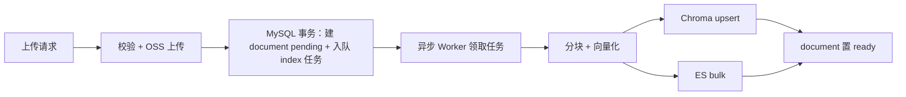
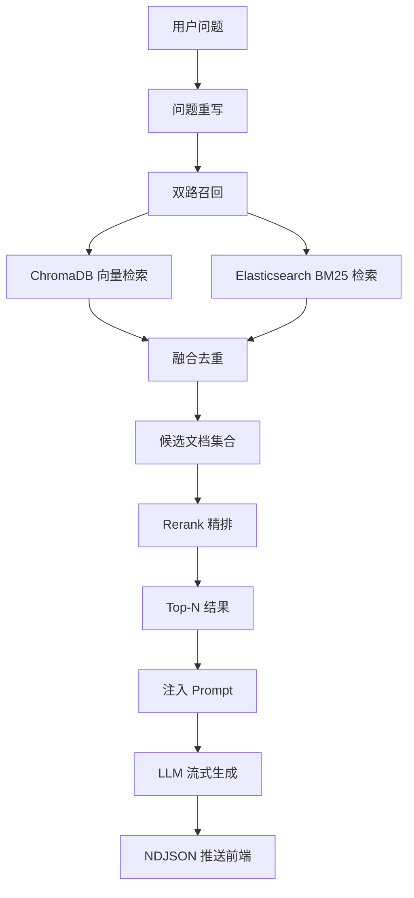

# 架构与功能说明

## 项目结构

```text
xlt/
├── ai/                      # AI 服务层
│   ├── chat.py              # 流式对话、总结、恶意检测和问题重写
│   ├── chroma_service.py    # Chroma 向量数据库服务
│   ├── embedding.py         # 文本向量化服务
│   ├── es_service.py        # Elasticsearch BM25 检索服务
│   ├── hybrid_search_service.py # 向量、BM25 和 Rerank 混合检索
│   ├── ingestion_service.py # 文档入库及双写服务
│   ├── indexing_worker.py   # 文档索引/删除异步 Worker
│   ├── reconciliation_service.py # 索引对账与任务恢复服务
│   └── rerank_service.py    # 重排服务
├── authentication/           # 认证与权限依赖
├── config/                   # 数据库、AI、JWT、文件、OSS 和 Worker 配置
│   └── prompts/              # AI 提示词模板
├── crud/                     # 数据访问层
├── model/                    # Pydantic 业务模型、软删除约定和统一响应
├── router/                   # 业务路由层
├── scripts/                  # 接口文档、密码和失败任务重置脚本
├── sql/                      # 初始化脚本
├── util/                     # 数据库、文件、JWT、密码、OSS 和软删除改名工具
├── tests/                    # 测试代码
├── frontend/                 # Vue 前端项目
├── main.py                   # 应用入口
├── start.bat                 # Windows 一键启动后端、Worker 和前端
└── pyproject.toml            # Python 项目配置
```

ChromaDB 的持久化数据默认写入根目录 `chroma_db/`，该目录已被 Git 忽略。

## 技术栈细节

后端使用 FastAPI、Uvicorn 和 Pydantic 2，数据存储使用 MySQL，向量检索使用 ChromaDB，全文检索使用 Elasticsearch 8.x 和 IK 中文分词器。AI 服务包括对话模型、向量模型和 Rerank 模型，具体名称与服务地址由 `config/ai_config.py` 配置。

前端使用 Vue 3、Vite、Element Plus、Vue Router 4、Pinia 4、Axios 和 markdown-it。普通请求复用请求工具，聊天接口使用 Fetch Streams 读取 NDJSON；页面支持桌面端和移动端布局。

## 核心功能

### 智能问答

- 向量检索和 Elasticsearch BM25 双路召回
- Reranker 模型精排
- 结合对话历史重写问题
- 会话标题自动总结
- 恶意内容检测
- NDJSON 流式回答和 Markdown 渲染

### 知识库管理

- 多知识库创建与管理
- Markdown、TXT、PDF、DOCX 文档解析
- 文本切片、向量化和 ChromaDB/Elasticsearch 双写（异步 Worker 执行）
- 文档上传采用 UUID 对象 key，同名文件互不覆盖
- 文档状态持久化（pending/indexing/ready/failed/deleting/deleted）与失败重试
- 文档删除与知识库索引清理（异步任务，Chroma/ES 幂等删除）

### 角色与权限

用户通过 `role_user` 和 `role_knowledge_base` 关联关系获得知识库访问权限。角色-知识库权限 `0` 表示只读，`1` 表示读写；用户拥有多个角色时取最大权限。只有读写权限允许上传和删除文档，知识库创建、改名和删除仅限管理员。

### 其他业务功能

- 多会话创建、切换、重命名和删除
- 公告发布、附件上传和置顶
- 管理概览与常用入口
- 用户端、管理端和聊天页的统一导航与移动端适配

## 前端页面

前端按角色分为登录、聊天、用户端和管理端，路径如下。

| 路径 | 说明 |
| --- | --- |
| `/`、`/login` | 登录 |
| `/chat` | 问答与会话 |
| `/user/my` | 个人中心（用户端默认页） |
| `/user/knowledgeBase` | 可访问知识库与文档 |
| `/user/announcement` | 公告 |
| `/user/role` | 我的角色 |
| `/user/session` | 会话管理 |
| `/admin/index` | 管理概览（管理端默认页） |
| `/admin/knowledgeBase` | 知识库与文档管理 |
| `/admin/role` | 角色与权限 |
| `/admin/user` | 用户管理 |
| `/admin/session` | 会话管理 |
| `/admin/announcement` | 公告管理 |

页面源码位于 `frontend/src/views/`。接口路径和聊天协议见 [API 与聊天协议](API与聊天协议.md)。

## 数据库概览

| 表名                      | 说明                  |
|---------------------------|-----------------------|
| `user`                    | 用户                  |
| `role`                    | 角色                  |
| `role_user`               | 角色-用户关联         |
| `knowledge_base`          | 知识库                |
| `role_knowledge_base`     | 角色-知识库关联及权限 |
| `document`                | 文档（含索引状态字段） |
| `document_task`           | 文档索引/删除异步任务  |
| `session`                 | 会话                  |
| `message`                 | 消息                  |
| `announcement`            | 公告                  |
| `announcement_attachment` | 公告附件              |

除 `document_task` 任务状态表外，业务表均包含 `is_deleted` 和 `deleted_at` 字段。普通业务查询默认过滤已删除记录；数据库外键统一使用 `RESTRICT`，避免隐性级联硬删除。已逻辑删除的用户、角色、知识库及其关联不参与权限计算，旧 JWT 不能继续访问。

`user.username`、`role.name`、`knowledge_base.name` 保持整表 `UNIQUE`。软删除这些实体时，在同一条 `UPDATE` 中把唯一名称改为 `{原名}__{uuid32}` 并置 `is_deleted=1`，从而释放原名供重建；查重接口仍只扫描未删除记录。会话名、文档文件名和公告标题本来就不是唯一约束，删除时不改名。

项目不存在独立的用户-知识库关联表，用户访问范围由两个角色关联表联查获得。

## 文档异步索引流程

文档上传走 outbox：请求内只完成校验、OSS 上传和任务入队，向量化与双写由独立 Worker 异步执行。



- `document` 表持久化状态：`pending`（待索引）、`indexing`（索引中）、`ready`（可用）、`failed`（失败）、`deleting`（删除中）、`deleted`（已删除），并记录失败原因与重试次数。
- `document_task` 表作为持久化任务队列（outbox 模式），Worker 独立进程消费；任务领取会记录 Worker 租约，进程崩溃后由对账服务按租约超时恢复卡死任务，完成和失败更新会校验租约所有权。
- 知识库文档和公告附件的 OSS 对象 key 均使用 UUID，原始文件名仅用于展示和下载，同名上传互不覆盖。
- 删除文档/知识库同样入队异步执行：Chroma/ES 索引真实且幂等删除，MySQL 记录与任务完成状态在同一事务中逻辑删除，OSS 对象保留。失败任务按指数退避自动重试，超过 `max_retries`（默认 `5`）后标记为 `failed`，需人工排查，避免把有限次重试误认为永久成功。
- 对账服务定期核对未逻辑删除的 ready 文档在 Chroma/ES 的切片数，不一致自动补索引；服务不删除 OSS 对象，避免误删留存文件。

## 混合检索流程



ChromaDB 与 Elasticsearch 的切片 ID 使用相同的 `{document_id}_{chunk_index}` 格式（即 `document_id_chunk_index`），混合检索按该 ID 融合去重。

## 相关文档

- [配置与数据库说明](配置与数据库.md)：环境变量、Worker 参数和常见问题
- [API 与聊天协议](API与聊天协议.md)：接口模块和聊天 NDJSON
- [开发与部署说明](开发与部署.md)：测试、限制和部署注意
